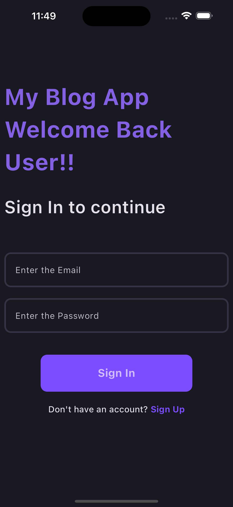
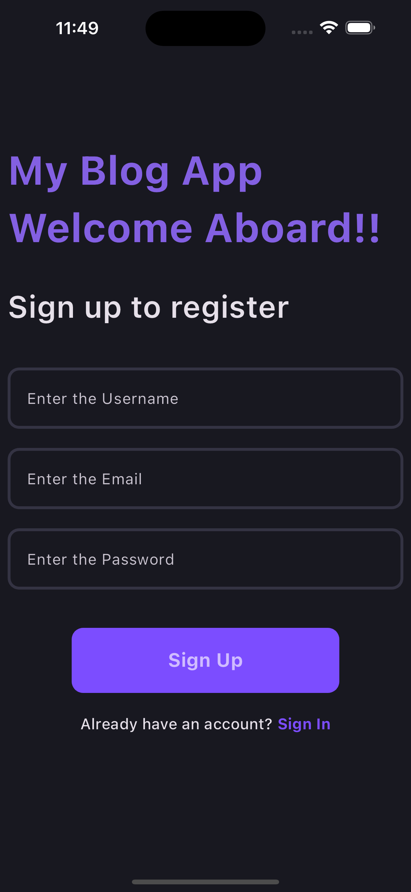
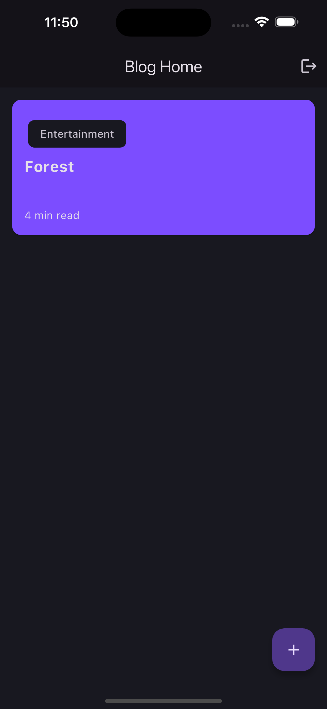
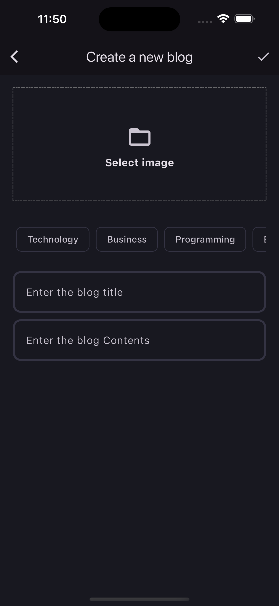
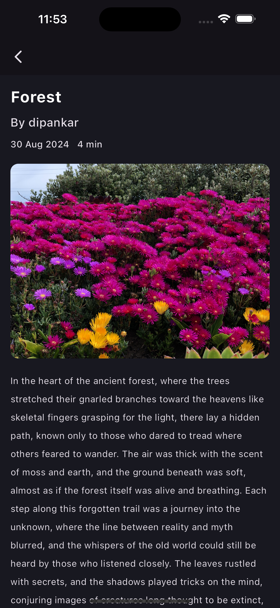
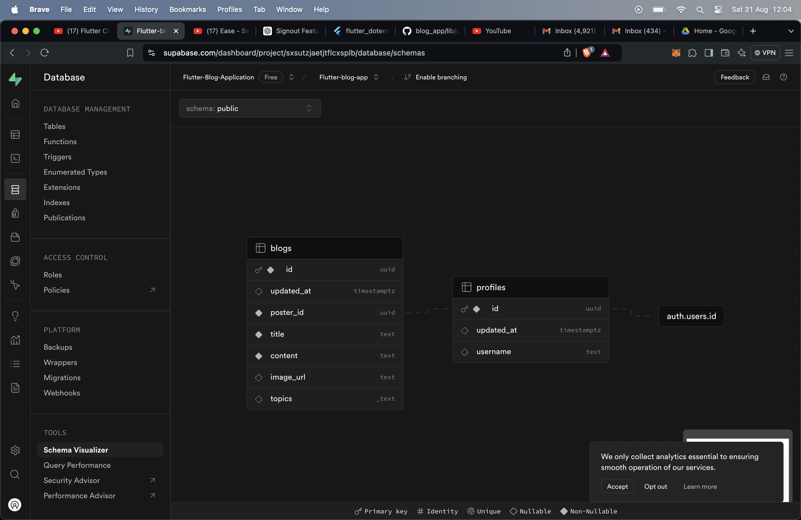

# Flutter Blog Application

A blog application using flutter and bloc along with supabase for authentication, database and storage purpose.

## Features

- Authentication using Supabase
- State management using Flutter Bloc
- Blog creation and saving in supabase sql database
- Image storage in supabase bucket
- Comprehensive user interface which is easy to use for better user experience

## Supabase

Utilizes supabase feaetures and services in the application as an alternative for firebase. Authentication, storage and database services are utilized.

## Clean Architecture

The application is developed using feature-based development and thus Clean Architecture is used to have SOLID principles maintained throughout the project.
There is separation of concern between the two features provided by the application:

- authentication
- blog features

## Bloc

The application uses flutter bloc for the state management purpose. All the states are handled and managed with the help of events and states. Flutter bloc is in sync with the clean architecture

## Dependancy Injection

Dependancy injection for the application is provided using the GetIt package. All the dependancies are injected and there is proper maintainance of separation of concern between the dependancies of different features.

## SOLID principle

Solid principle is taken care of with the help of Clean architecutre.

- **Single Responsibility:** Each usecase has only one action and is isolated. Same with repositories.
- **Open Close:** Business logic is defined by interfaces. Interface based development is practiced.
- **Liskov Substitution Principle:** Concrete implementations of use cases or repositories can replace the base class without affecting the system’s correctness.
- **Interface Segregation Principle:** Interfaces are designed and made small and specific.
- **Dependancy Inversion Principle:** High level modules are dependent on interfaces rather than implementation.

This way, the whole application follows the SOLID principles during development.

## Screenshots:

## Demo Video:

[Video](https://drive.google.com/file/d/1u5Buw0DT1hbS0ahqacGJN_1p8CyY5cM2/view?usp=sharing)

## Supabase Database Schema

